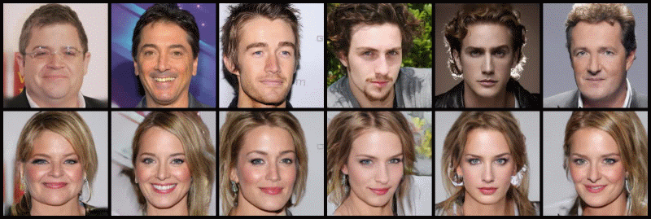

# GP-UNIT - Official PyTorch Implementation


This repository provides the official PyTorch implementation for the following paper:

**Unsupervised Image-to-Image Translation with Generative Prior**<br>
[Shuai Yang](https://williamyang1991.github.io/), [Liming Jiang](https://liming-jiang.com/), [Ziwei Liu](https://liuziwei7.github.io/) and [Chen Change Loy](https://www.mmlab-ntu.com/person/ccloy/)<br>
In CVPR 2022.<br>
[**Project Page**](https://www.mmlab-ntu.com/project/gpunit/) | [**Paper**]() (coming soon)
> **Abstract:** *Unsupervised image-to-image translation aims to learn the translation between two visual domains without paired data. Despite the recent progress in image translation models, it remains challenging to build mappings between complex domains with drastic visual discrepancies. In this work, we present a novel framework, Generative Prior-guided UNsupervised Image-to-image Translation (GP-UNIT), to improve the overall quality and applicability of the translation algorithm. Our key insight is to leverage the generative prior from pre-trained class-conditional GANs (e.g., BigGAN) to learn rich content correspondences across various domains. We propose a novel coarse-to-fine scheme: we first distill the generative prior to capture a robust coarse-level content representation that can link objects at an abstract semantic level, based on which fine-level content features are adaptively learned for more accurate multi-level content correspondences. Extensive experiments demonstrate the superiority of our versatile framework over state-of-the-art methods in robust, high-quality and diversified translations, even for challenging and distant domains.*


## Updates

- [03/2022] This website is created.

## Code

- We are cleaning our code. Coming soon. 

## (1) Dataset Preparation

Human face dataset, animal face dataset and aristic human face dataset can be downloaded from their official pages.
Bird, dog and car dataset can be built from ImageNet with our provided script.

| Task | Used Dataset | 
| :--- | :--- | 
| Male←→Female | [CelebA-HQ](https://github.com/clovaai/stargan-v2#datasets-and-pre-trained-networks): divided into male and female subsets by [StarGANv2](https://github.com/clovaai/stargan-v2#datasets-and-pre-trained-networks) |
| Dog←→Cat←→Wild| [AFHQ](https://github.com/clovaai/stargan-v2#datasets-and-pre-trained-networks) provided by [StarGANv2](https://github.com/clovaai/stargan-v2#datasets-and-pre-trained-networks) |
| Face←→Cat or Dog| [CelebA-HQ](https://github.com/switchablenorms/CelebAMask-HQ) and [AFHQ](https://github.com/clovaai/stargan-v2#datasets-and-pre-trained-networks) |
| Bird←→Dog | 4 classes of birds and 4 classes of dogs in ImageNet291. Please refer to [dataset preparation](./data_preparation#2-imagenet291) for building ImageNet291 from [ImageNet](https://image-net.org/download.php) |
| Bird←→Car | 4 classes of birds and 4 classes of cars in ImageNet291. Please refer to [dataset preparation](./data_preparation#2-imagenet291) for building ImageNet291 from [ImageNet](https://image-net.org/download.php) |
| Face→MetFace |  [CelebA-HQ](https://github.com/switchablenorms/CelebAMask-HQ) and [MetFaces](https://github.com/NVlabs/metfaces-dataset) |

## (2) Inference for Latent-Guided and Exemplar-Guided Translation

### Inference Notebook 
<a href="http://colab.research.google.com/github/williamyang1991/GP-UNIT/blob/master/notebooks/inference_playground.ipynb"></a>  
To help users get started, we provide a Jupyter notebook found in `./notebooks/inference_playground.ipynb` that allows one to visualize the performance of GP-UNIT.
The notebook will download the necessary pretrained models and run inference on the images found in `./data/`.

### Pretrained Models

Pretrained models can be downloaded from [Google Drive](https://drive.google.com/drive/folders/1GMGCPt1xfh0Zs82lfkQLifMZR27yANTI?usp=sharing) or [Baidu Cloud](https://pan.baidu.com/s/1GlCnwd_0EDHNTsQrvM0xhA?pwd=cvpr) (access code: cvpr):

| Task | Pretrained Models | 
| :--- | :--- | 
| Prior Distillation | [content encoder](https://drive.google.com/file/d/1I7_IMMheihcIR57vInof5g6R0j8wEonx/view?usp=sharing) |
| Male←→Female | generators for [male2female](https://drive.google.com/file/d/1I0xqtbuuPOhcteHH613PGX7uO3fMTf9r/view?usp=sharing) and [female2male](https://drive.google.com/file/d/19xIY0vqHVpah4UyXKgz7trWi1TdlPD_T/view?usp=sharing) |
| Dog←→Cat←→Wild| generators for [dog2cat](https://drive.google.com/file/d/1PJyk0hKClceTHRD6BORFVEpG-pl0lPFm/view?usp=sharing), [cat2dog](https://drive.google.com/file/d/1EvQRKY4AN1JxAElsOPkuqqSRZVCNL3gA/view?usp=sharing), [dog2wild](https://drive.google.com/file/d/11j0kG1EJoSLWX6AJ8kaIWp_QFAZoUdpI/view?usp=sharing), [wild2dog](https://drive.google.com/file/d/16lr7bce4qGEmUWlfKZuRatyX_OsKdNkg/view?usp=sharing), [cat2wild](https://drive.google.com/file/d/16sBFFxbc1zX2LfruMUuY7aVZekng032g/view?usp=sharing) and [wild2cat](https://drive.google.com/file/d/1LVNfpBdHPNog1_tk9rE5x_4oQUUV8uEy/view?usp=sharing) |
| Face←→Cat or Dog| generators for [face2cat](https://drive.google.com/file/d/1CKKXDaD0h6i1RFtbcHOL8Bj3P37_Cheh/view?usp=sharing), [cat2face](https://drive.google.com/file/d/1cAYIYU6JUunBRhw94cssp8cPnuD7hJgo/view?usp=sharing), [dog2face](https://drive.google.com/file/d/1OPINn14b_rwKdEO1l_2ON__ngBLSllPq/view?usp=sharing) and [face2dog](https://drive.google.com/file/d/1_RrsNvaswMuLqrUr79q8HBx9TcP_zS9y/view?usp=sharing) |
| Bird←→Dog | generators for [bird2dog](https://drive.google.com/file/d/1Nm0jAI6dxDLBUdIFPEx8qU002IUdBaTO/view?usp=sharing) and [dog2bird](https://drive.google.com/file/d/1Ud_IJTO8Ovi7T7lsMG3S9boYASemnVAB/view?usp=sharing) |
| Bird←→Car | generators for [bird2car](https://drive.google.com/file/d/1PR_AF8JnYMaXH3hKipGxUZEjgrUu_0r5/view?usp=sharing) and [car2bird](https://drive.google.com/file/d/1j1N6vMNhPt4beLDrwP-uBd-jgPoQqg4O/view?usp=sharing) |
| Face→MetFace | generator for [face2metface](https://drive.google.com/file/d/15IoEyUUY-1vnfqqVquVYMCleHVXt4jJs/view?usp=sharing) |

The saved checkpoints are under the following folder structure:
```
checkpoint
|--content_encoder.pt     % Content encoder
|--bird2car.pt            % Bird-to-Car translation model
|--bird2dog.pt            % Bird-to-Dog translation model
...
```

### Latent-Guided Translation
Translate a content image to the target domain with randomly sampled latent styles:
```python
python inference.py --generator_path PRETRAINED_GENERATOR_PATH --content_encoder_path PRETRAINED_ENCODER_PATH \ 
                    --content CONTENT_IMAGE_PATH --batch STYLE_NUMBER --device DEVICE
```
By default, the script will use `.\checkpoint\dog2cat.pt` as PRETRAINED_GENERATOR_PATH, `.\checkpoint\content_encoder.pt` as PRETRAINED_ENCODER_PATH, and
`cuda` as DEVICE for using GPU. For running on CPUs, use `--device cpu`.

Take Dog→Cat as an example, run:
> python inference.py --content ./data/afhq/images512x512/test/dog/flickr_dog_000572.jpg --batch 6

Six results `translation_flickr_dog_000572_N.jpg` (N=0~5) are saved in the folder `.\output\`.
An corresponding overview image `translation_flickr_dog_000572_overview.jpg` is additionally saved to illustrate the input content image and the six results: 


### Exemplar-Guided Translation
Translate a content image to the target domain in the style of a style image by additionally specifying `--style`:
```python
python inference.py --generator_path PRETRAINED_GENERATOR_PATH --content_encoder_path PRETRAINED_ENCODER_PATH \ 
                    --content CONTENT_IMAGE_PATH --style STYLE_IMAGE_PATH --device DEVICE
```

Take Dog→Cat as an example, run:
> python inference.py --content ./data/afhq/images512x512/test/dog/flickr_dog_000572.jpg --style ./data/afhq/images512x512/test/cat/flickr_cat_000418.jpg 

The result `translation_flickr_dog_000572_to_flickr_cat_000418.jpg` is saved in the folder `.\output\`.
An corresponding overview image `translation_flickr_dog_000572_to_flickr_cat_000418_overview.jpg` is additionally saved to illustrate the input content image, the style image, and the result: 


Another example of Cat→Wild, run:
> python inference.py --generator_path ./checkpoint/cat2wild.pt --content ./data/afhq/images512x512/test/cat/flickr_cat_000418.jpg --style ./data/afhq/images512x512/test/wild/flickr_wild_001112.jpg

The overview image is as follows: 


## Results

#### Male-to-Female: close domains



#### Cat-to-Dog: related domains 


#### Dog-to-Human and Bird-to-Dog: distant domains  


#### Bird-to-Car: extremely distant domains for stress testing


## Citation

If you find this work useful for your research, please consider citing our paper:

```bibtex
@inproceedings{yang2022Unsupervised,
  title={Unsupervised Image-to-Image Translation with Generative Prior},
  author={Yang, Shuai and Jiang, Liming and Liu, Ziwei and Loy, Chen Change},
  booktitle={CVPR},
  year={2022}
}
```

## Acknowledgments

The code is developed based on [StarGAN v2](https://github.com/clovaai/stargan-v2) and [Imaginaire](https://github.com/nvlabs/imaginaire).
